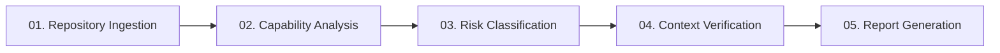
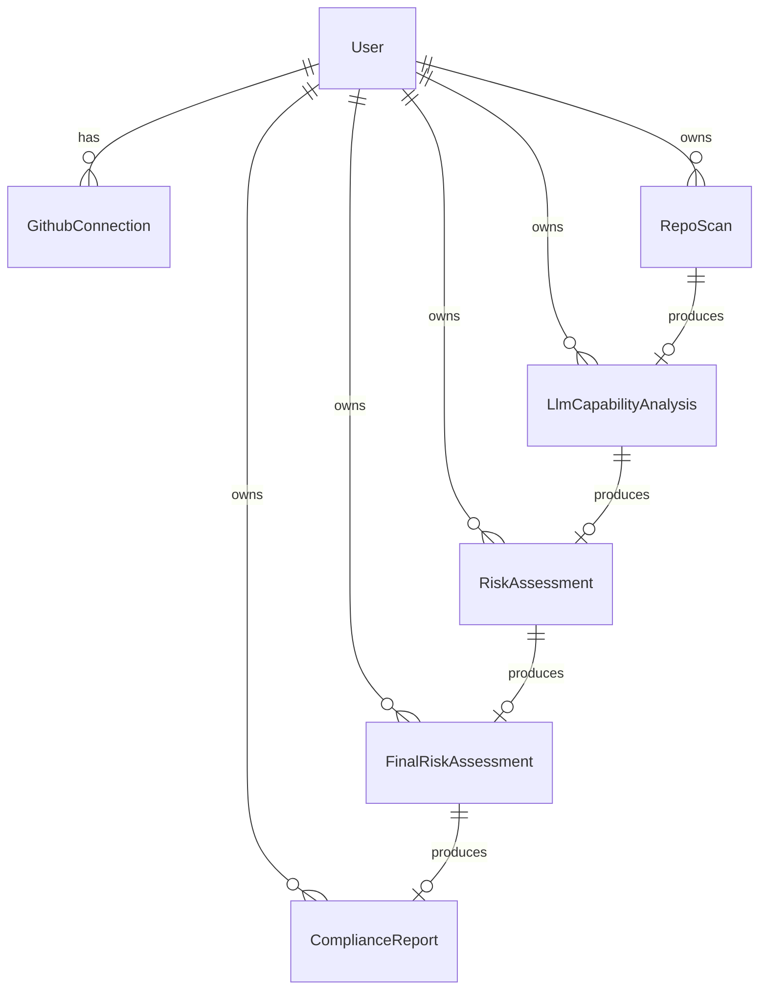
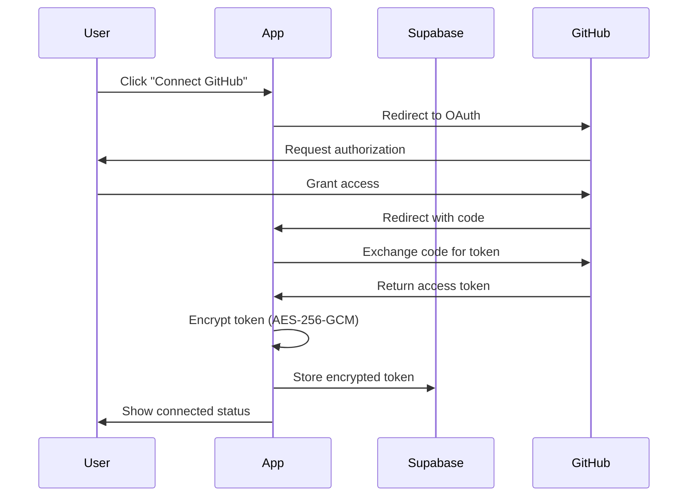

# ComplianceAI - Product Instruction Document

> **Purpose:** This document serves as the definitive technical reference for the ComplianceAI product. It provides detailed workflows, feature specifications, and architectural context to enable accurate understanding and modification of the codebase.

---

## Table of Contents

1. [Product Overview](#product-overview)
2. [Technology Stack](#technology-stack)
3. [Complete Product Workflow](#complete-product-workflow)
4. [Feature Deep Dive](#feature-deep-dive)
   - [Feature 1: Repository Ingestion](#feature-1-repository-ingestion)
   - [Feature 2: Capability Analysis](#feature-2-capability-analysis)
   - [Feature 3: Risk Classification](#feature-3-risk-classification)
   - [Feature 4: Context Verification](#feature-4-context-verification)
   - [Feature 5: Report Generation](#feature-5-report-generation)
5. [Database Schema](#database-schema)
6. [API Reference](#api-reference)
7. [Authentication Flow](#authentication-flow)
8. [File Structure](#file-structure)

---

## Product Overview

**ComplianceAI** is an EU AI Act compliance assessment platform that analyzes GitHub repositories to determine if they contain AI systems and classifies their risk level according to the EU AI Act regulations. The product generates professional compliance reports with digital signatures.

### Core Value Proposition

- **Automated Repository Analysis**: Scans GitHub repositories to detect AI/ML components
- **EU AI Act Compliance**: Maps detected capabilities to Annex III articles
- **Risk Classification**: Categorizes systems as UNACCEPTABLE, HIGH_RISK, LIMITED_RISK, or MINIMAL_RISK
- **Context Verification**: Refines assessments through user questionnaires
- **Professional Reports**: Generates signed PDF compliance certificates

---

## Technology Stack

| Layer | Technology |
|-------|------------|
| **Framework** | Next.js 14+ (App Router) |
| **Language** | TypeScript |
| **Database** | PostgreSQL via Prisma ORM |
| **Authentication** | Supabase Auth (GitHub OAuth) |
| **Storage** | Supabase Storage (PDF reports) |
| **LLM Provider** | Groq API (Llama-3 / Mixtral models) |
| **PDF Generation** | PDFKit |
| **Styling** | Tailwind CSS |
| **Animations** | Framer Motion |

---

## Complete Product Workflow

The product operates as a **5-stage sequential pipeline**. Each stage must complete before the next can begin.



### Workflow Summary

| Stage | Input | Process | Output | Dashboard Page |
|-------|-------|---------|--------|----------------|
| **01** | GitHub repo URL | Scan repo via GitHub API | `RepoScan` record | `/dashboard/scanner` |
| **02** | `repo_scan_id` | LLM analysis via Groq | `LlmCapabilityAnalysis` record | `/dashboard/analyzer/[repo_scan_id]` |
| **03** | `repo_scan_id` | Map to Annex III articles | `RiskAssessment` record | `/dashboard/risk-classifier/[repo_scan_id]` |
| **04** | `risk_assessment_id` + answers | Refine with user context | `FinalRiskAssessment` record | `/dashboard/context-verifier/[repo_scan_id]` |
| **05** | `final_risk_assessment_id` | Generate signed PDF | `ComplianceReport` record | `/dashboard/report/[repo_scan_id]` |

---

## Feature Deep Dive

### Feature 1: Repository Ingestion

**Purpose:** Connect to GitHub, select a repository, and extract its contents for analysis.

#### User Flow

1. User clicks "Connect GitHub" button
2. OAuth flow redirects to GitHub for authorization
3. User grants read-only repository access
4. Access token is encrypted (AES-256-GCM) and stored
5. User selects a repository from dropdown
6. System scans repository and extracts metadata

#### Files Involved

| File | Purpose |
|------|---------|
| `src/app/dashboard/scanner/page.tsx` | Scanner UI with 3-step wizard |
| `src/components/GitHubConnectButton.tsx` | OAuth trigger button |
| `src/components/RepoSelector.tsx` | Repository dropdown selector |
| `src/components/ScanStatus.tsx` | Scan progress indicator |
| `src/lib/github.ts` | GitHub API client library |
| `src/lib/encryption.ts` | Token encryption utilities |
| `src/app/api/auth/github/callback/route.ts` | OAuth callback handler |
| `src/app/api/github/route.ts` | GitHub operations API |

#### Data Extracted from Repository

| Field | Description | Source |
|-------|-------------|--------|
| `readme_content` | README.md file contents | GitHub API |
| `package_json_content` | package.json parsed as JSON | GitHub API |
| `requirements_txt_content` | requirements.txt file contents | GitHub API |
| `pyproject_toml_content` | pyproject.toml parsed as JSON | GitHub API |
| `file_tree` | Complete directory structure | GitHub Tree API |
| `primary_language` | Main programming language | Repository metadata |
| `license_type` | SPDX license identifier | Repository metadata |
| `stars_count`, `forks_count`, `watchers_count` | Repository popularity metrics | Repository metadata |

#### Database Table: `repo_scans`

Stores the raw scan output. Each scan expires after 30 days.

---

### Feature 2: Capability Analysis

**Purpose:** Use LLM to analyze repository contents and detect AI/ML capabilities.

#### Process Flow

1. Fetch `RepoScan` by `repo_scan_id`
2. Build analysis prompt with repository data
3. Send to Groq API (Llama-3 model)
4. Parse and validate JSON response
5. Calculate confidence score
6. Store results in database

#### Files Involved

| File | Purpose |
|------|---------|
| `src/app/dashboard/analyzer/[repo_scan_id]/page.tsx` | Analyzer UI |
| `src/components/CapabilityCard.tsx` | Displays detected capabilities |
| `src/lib/groq.ts` | Groq API client and prompt builder |
| `src/app/api/analyze-capabilities/route.ts` | Analysis trigger endpoint |
| `src/app/api/capability-analysis/route.ts` | Fetch existing analysis |

#### LLM Analysis Output

The Groq API returns a structured JSON object with:

```typescript
interface AnalysisResult {
    // Core detection
    is_ai_system: boolean;
    capabilities: string[];      // ["Computer Vision", "NLP", "Recommender"]
    libraries: string[];         // ["torch", "tensorflow", "scikit-learn"]
    ai_frameworks: string[];     // ["PyTorch", "Hugging Face"]
    programming_languages: string[];
    detected_model_types: string[];
    
    // Code structure indicators
    has_ml_pipeline: boolean;
    has_training_code: boolean;
    has_inference_code: boolean;
    has_data_processing: boolean;
    has_model_serialization: boolean;
    
    // Risk indicators (for Feature 3)
    estimated_risk_indicators: {
        uses_computer_vision: boolean;
        uses_biometric_processing: boolean;
        uses_emotion_recognition: boolean;
        uses_critical_infrastructure: boolean;
        uses_generative_ai: boolean;
        uses_nlp: boolean;
        uses_nlp_decision_making: boolean;
        targets_vulnerable_persons: boolean;
        high_impact_decision_making: boolean;
        reasoning: string;
    };
}
```

#### Rate Limiting

- **5 analyses per hour** per user
- In-memory rate limit tracking (use Redis in production)

---

### Feature 3: Risk Classification

**Purpose:** Map detected AI capabilities to EU AI Act Annex III articles and determine preliminary risk classification.

#### Classification Algorithm

1. Check for UNACCEPTABLE risks (banned AI practices)
2. Check for HIGH_RISK indicators against Annex III articles
3. Check for LIMITED_RISK transparency obligations
4. Default to MINIMAL_RISK if no matches

#### Files Involved

| File | Purpose |
|------|---------|
| `src/app/dashboard/risk-classifier/[repo_scan_id]/page.tsx` | Risk classifier UI |
| `src/components/RiskClassificationCard.tsx` | Risk display component |
| `src/components/RiskScoreGauge.tsx` | Visual risk score gauge |
| `src/lib/risk-classifier.ts` | Core classification engine |
| `src/lib/annex-iii-articles.ts` | EU AI Act article definitions |
| `src/app/api/classify-risk/route.ts` | Classification trigger endpoint |

#### Risk Classifications

| Classification | Risk Score | Description |
|----------------|------------|-------------|
| `UNACCEPTABLE` | 90-100 | Banned AI practices (subliminal manipulation, social scoring, real-time biometric ID) |
| `HIGH_RISK` | 60-89 | Subject to strict requirements (biometrics, employment, credit, law enforcement) |
| `LIMITED_RISK` | 30-59 | Transparency obligations (chatbots, deepfakes, recommender systems) |
| `MINIMAL_RISK` | 0-29 | No specific requirements |

#### Annex III Article Categories

The system maps capabilities to these high-risk categories:

| Article | Category |
|---------|----------|
| 6-9 | Biometric Identification & Categorization |
| 10-14 | Critical Infrastructure |
| 20 | Education & Vocational Training |
| 21 | Employment, Worker Management |
| 22 | Access to Essential Services (credit, insurance, benefits) |
| 23 | Law Enforcement |
| 24 | Migration, Asylum & Border Control |
| 25 | Administration of Justice |
| 26 | Autonomous Vehicles |

#### Limited Risk Articles

| Article | Category |
|---------|----------|
| 37 | Emotion Recognition Systems |
| 38 | Biometric Categorization (non-ID) |
| 39 | Generative AI / Synthetic Content |
| 40 | Recommender Systems |

---

### Feature 4: Context Verification

**Purpose:** Refine preliminary risk assessment through user-provided context about deployment, oversight, and compliance measures.

#### Question Generation Logic

Questions are dynamically generated based on:
1. Preliminary risk classification
2. Matched Annex III articles
3. Detected capabilities

#### Files Involved

| File | Purpose |
|------|---------|
| `src/app/dashboard/context-verifier/[repo_scan_id]/page.tsx` | Questionnaire UI |
| `src/components/QuestionSet.tsx` | Question rendering component |
| `src/components/FinalAssessmentCard.tsx` | Final assessment display |
| `src/lib/context-questions.ts` | Question definitions |
| `src/lib/context-refiner.ts` | Context refinement engine |
| `src/app/api/context-questions/route.ts` | Fetch questions endpoint |
| `src/app/api/verify-context/route.ts` | Submit answers endpoint |

#### Question Sets

| Set ID | Title | When Asked |
|--------|-------|------------|
| `use_case` | Use Case Questions | Always |
| `biometrics` | Biometric Processing | Article 6-9 matched |
| `employment` | Employment Decisions | Article 21 matched |
| `essential_services` | Essential Services | Article 22 matched |
| `law_enforcement` | Law Enforcement | Article 23 matched |
| `generative_ai` | Generative AI Transparency | Generative AI detected |
| `technical_safeguards` | Technical Safeguards | HIGH_RISK systems |
| `deployment_context` | Deployment Context | Always (HIGH_RISK) |

#### Context Answers Structure

```typescript
interface ContextAnswers {
    primary_purpose?: string;
    primary_users?: string;
    autonomous_decisions?: string;
    uses_biometrics?: string;
    law_enforcement_use?: boolean;
    biometric_opt_out?: string;
    uses_for_hiring?: string;
    hiring_transparency?: string;
    hiring_appeal_process?: string;
    financial_decisions?: string;
    quality_monitoring?: string;
    deployment_region?: string;
    operator_type?: string;
    human_oversight?: string;
    testing_procedure?: string;
    error_procedure?: string;
    transparency_statement?: string;
    support_contact?: string;
    data_protection?: string;
}
```

#### Final Assessment Output

```typescript
interface FinalAssessmentResult {
    final_risk_classification: RiskClassification;
    final_risk_score: number;  // May adjust ±15 points from preliminary
    final_narrative: string;
    context_verified: boolean;
    context_summary: ContextSummary;
    evidence_items: EvidenceItem[];
    final_matched_articles: MatchedArticle[];
    unresolved_risk_indicators: string[];
    escalation_reason?: string;
    compliance_readiness: ComplianceReadiness;
    approved_for_report: boolean;
    requires_manual_review: boolean;
}
```

---

### Feature 5: Report Generation

**Purpose:** Generate a professional PDF compliance report, digitally sign it, and store in Supabase.

#### Report Structure (20+ pages)

1. **Title Page** - Repository info, classification, date
2. **Executive Summary** - Key findings, risk overview
3. **System Overview** - Detected capabilities, technologies
4. **Risk Assessment** - Classification rationale, matched articles
5. **Evidence Section** - User-provided context evidence
6. **Compliance Roadmap** - Action items, requirements
7. **Regulatory Analysis** - Applicable regulations
8. **Appendices** - Technical details
9. **Certificate Page** - Digital signature, hash

#### Files Involved

| File | Purpose |
|------|---------|
| `src/app/dashboard/report/[repo_scan_id]/page.tsx` | Report generator UI |
| `src/components/ReportDownloadCard.tsx` | Download/view component |
| `src/components/StorageStatus.tsx` | Storage quota display |
| `src/lib/pdf-generator.ts` | PDFKit report builder |
| `src/lib/report-signer.ts` | Digital signature generator |
| `src/lib/storage.ts` | Supabase storage operations |
| `src/app/api/generate-report/route.ts` | Report generation endpoint |
| `src/app/api/reports/[id]/route.ts` | Fetch report endpoint |
| `src/app/api/reports/[id]/download/route.ts` | Download report endpoint |

#### Digital Signature

- Uses SHA-256 hash of PDF content
- Stored in `ComplianceReport.digital_signature`
- Timestamp recorded in `ComplianceReport.signed_at`

#### Storage

- Reports stored in Supabase Storage bucket: `compliance-reports`
- Path format: `{user_id}/{report_id}/{filename}.pdf`
- Signed URLs expire after 7 days
- Storage quota check before generation

---

## Database Schema

### Entity Relationship



### Tables Overview

| Table | Purpose | Key Fields |
|-------|---------|------------|
| `users` | User accounts | `id`, `email`, `full_name` |
| `github_connections` | Encrypted OAuth tokens | `github_oauth_token` (AES-256-GCM encrypted) |
| `repo_scans` | Repository scan data | `readme_content`, `file_tree`, `package_json_content` |
| `llm_capability_analyses` | LLM analysis results | `capabilities`, `libraries`, `ai_frameworks`, `estimated_risk_indicators` |
| `risk_assessments` | Preliminary risk classification | `risk_classification`, `risk_score`, `matched_annex_iii_articles` |
| `final_risk_assessments` | Context-verified assessment | `final_risk_classification`, `context_summary`, `evidence_items`, `approved_for_report` |
| `compliance_reports` | Generated PDF reports | `file_path`, `file_url`, `digital_signature` |

### Data Expiration

- `repo_scans`: 30 days
- `llm_capability_analyses`: 30 days
- `compliance_reports`: Signed URLs expire in 7 days

---

## API Reference

### Authentication Endpoints

| Method | Endpoint | Purpose |
|--------|----------|---------|
| GET | `/api/auth/github` | Initiate GitHub OAuth |
| GET | `/api/auth/github/callback` | OAuth callback handler |

### Core Pipeline Endpoints

| Method | Endpoint | Purpose | Rate Limit |
|--------|----------|---------|------------|
| POST | `/api/github/scan` | Scan repository | - |
| GET | `/api/repo-scans/[id]` | Get scan data | - |
| POST | `/api/analyze-capabilities` | Trigger LLM analysis | 5/hour |
| GET | `/api/capability-analysis` | Get analysis results | - |
| POST | `/api/classify-risk` | Trigger risk classification | 10/hour |
| GET | `/api/risk-assessment` | Get risk assessment | - |
| GET | `/api/context-questions` | Get dynamic questionnaire | - |
| POST | `/api/verify-context` | Submit context answers | 5/hour |
| GET | `/api/final-risk-assessment` | Get final assessment | - |
| POST | `/api/generate-report` | Generate PDF report | - |
| GET | `/api/reports/[id]` | Get report metadata | - |
| GET | `/api/reports/[id]/download` | Download PDF | - |
| DELETE | `/api/reports/[id]` | Delete report | - |

### Utility Endpoints

| Method | Endpoint | Purpose |
|--------|----------|---------|
| GET | `/api/llm-health` | Check Groq API status |
| GET | `/api/storage-quota` | Check storage usage |
| GET | `/api/annex-iii-articles` | Get all Annex III articles |
| POST | `/api/escalate-review` | Flag for manual review |

---

## Authentication Flow



### Session Management

- Sessions managed by Supabase Auth
- Middleware (`src/middleware.ts`) protects `/dashboard/*` routes
- Redirects unauthenticated users to `/auth`

---

## File Structure

```
src/
├── app/
│   ├── api/
│   │   ├── analyze-capabilities/route.ts   # Feature 2 trigger
│   │   ├── auth/github/callback/route.ts   # OAuth callback
│   │   ├── classify-risk/route.ts          # Feature 3 trigger
│   │   ├── context-questions/route.ts      # Feature 4 questions
│   │   ├── generate-report/route.ts        # Feature 5 trigger
│   │   ├── verify-context/route.ts         # Feature 4 submit
│   │   └── ...
│   ├── auth/page.tsx                       # Login page
│   ├── dashboard/
│   │   ├── scanner/page.tsx                # Feature 1 UI
│   │   ├── analyzer/[repo_scan_id]/page.tsx
│   │   ├── risk-classifier/[repo_scan_id]/page.tsx
│   │   ├── context-verifier/[repo_scan_id]/page.tsx
│   │   └── report/[repo_scan_id]/page.tsx
│   └── page.tsx                            # Landing page
├── components/
│   ├── CapabilityCard.tsx
│   ├── FinalAssessmentCard.tsx
│   ├── GitHubConnectButton.tsx
│   ├── QuestionSet.tsx
│   ├── RepoSelector.tsx
│   ├── ReportDownloadCard.tsx
│   ├── RiskClassificationCard.tsx
│   ├── RiskScoreGauge.tsx
│   └── ...
├── lib/
│   ├── annex-iii-articles.ts      # EU AI Act article definitions
│   ├── context-questions.ts        # Question set definitions
│   ├── context-refiner.ts          # Feature 4 engine
│   ├── encryption.ts               # AES-256-GCM utilities
│   ├── github.ts                   # GitHub API client
│   ├── groq.ts                     # Groq LLM client
│   ├── pdf-generator.ts            # PDFKit report builder
│   ├── prisma.ts                   # Prisma client singleton
│   ├── report-signer.ts            # Digital signature
│   ├── risk-classifier.ts          # Feature 3 engine
│   ├── storage.ts                  # Supabase storage
│   ├── supabase.ts                 # Supabase client
│   └── supabase-server.ts          # Server-side Supabase
└── middleware.ts                   # Auth middleware
```

---

## Environment Variables

| Variable | Purpose |
|----------|---------|
| `DATABASE_URL` | PostgreSQL connection string |
| `DIRECT_URL` | Direct database connection (bypasses pooler) |
| `NEXT_PUBLIC_SUPABASE_URL` | Supabase project URL |
| `NEXT_PUBLIC_SUPABASE_ANON_KEY` | Supabase anonymous key |
| `SUPABASE_SERVICE_ROLE_KEY` | Supabase service role key |
| `GITHUB_CLIENT_ID` | GitHub OAuth app client ID |
| `GITHUB_CLIENT_SECRET` | GitHub OAuth app secret |
| `GROQ_API_KEY` | Groq API key for LLM access |
| `ENCRYPTION_KEY` | AES-256 key for token encryption |
| `PDF_SIGNING_KEY` | Key for PDF digital signatures |

---

## Key Implementation Notes

### Error Handling

- All API routes return consistent JSON error responses
- Rate limit errors return 429 with `resetAt` timestamp
- Authentication errors return 401
- Validation errors return 400 with descriptive messages

### Caching Strategy

- Existing assessments are returned without re-computation
- Each pipeline stage checks for cached results before processing
- Cache indicated by `cached: true` in API responses

### Security Considerations

- GitHub tokens encrypted at rest with AES-256-GCM
- Row Level Security (RLS) enforced at database level
- All dashboard routes protected by authentication middleware
- PDF signatures provide tamper evidence

---

*Last Updated: January 2026*
